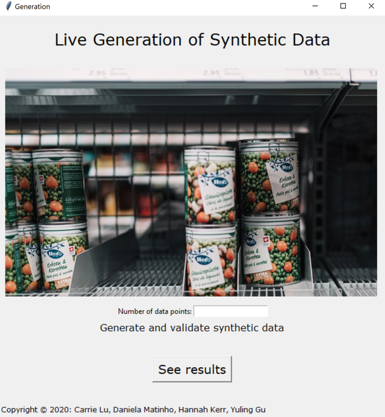

# An interface to evaluate Synthetic Data - Live

## Mail Goal: Build an interface that shows Syntehtic VS Real data
The objetif is to use visuals to understand how similar is synthetic data generated by the GAN model developed compared to real data. This platform can be used with any data tabular data source.  

### Group poject: Daniela Matinho (myself), Carrie Lu, Hannah Kerr, and Yuling Gu

### Below you can see how the interface looks like.
1. You can generate any quantity of data points you wish (if the number is large, it might take longer)
2. Once the synthetic data is generated, the second window will appear automatically
3. We selected a few grpahs that we thought were easier to understand how similar the real and synthetic data are

#### Generator:
This windows has a pre-buildit CT-GAN model to generate synthetic tabular data taking in account the characteristics of the input data. The main goal is to generated synthetic data out or the real data as similar as possible (similar distribution, features...)

#### Validation:
This windows appears once the data is generated and it is composed of the log mean and log standard deviation of real and synthetic data. In addition, it has the comparasion of few categorical variables from the dataset as well as the correlation among different variables in the real and synthetic datasets.

### This reposotory contains:
1. firstpageloadmodel: contain the model that generate synthetic data out of the real data
2. grpah: contains all the visuals to evaluate how similar real and syntehtic data are
3. Images
