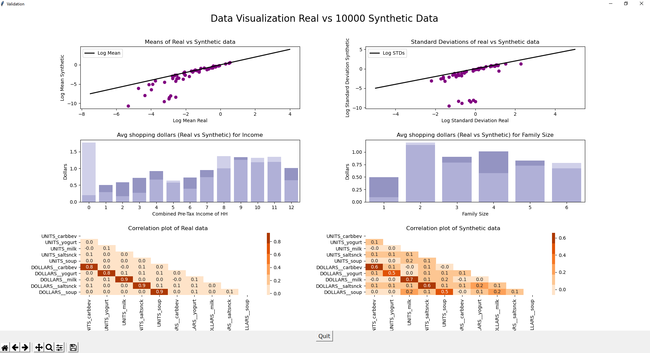

# An interface to evaluate Synthetic Data - Live

## Mail Goal: Build an interface that shows Syntehtic VS Real data
The objetif is to use visuals to understand how similar is synthetic data generated by the GAN model developed compared to real data. This platform can be used with any data tabular data source.  

### Group poject: Daniela Matinho (myself), Carrie Lu, Hannah Kerr, and Yuling Gu

### This reposotory contains:
1. firstpageloadmodel: contain the model that generate synthetic data out of the real data

2. grpah: contains all the visuals to evaluate how similar real and syntehtic data are

